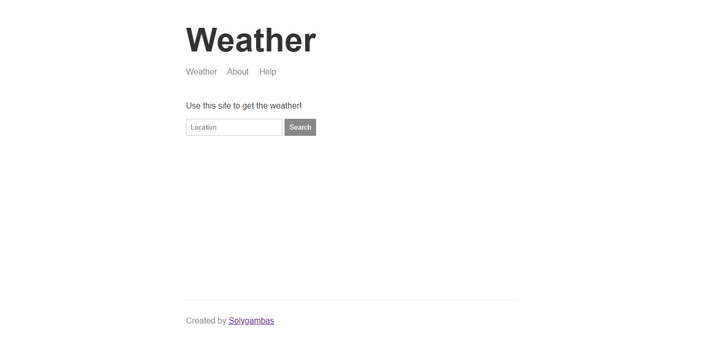

# Task App and Node.js projects

A task manager REST API using MongoDB, Mongoose and Express (plus 3 other Node.js projects).

| #   | Project                           | Description                                           |
| --- | --------------------------------- | ----------------------------------------------------- |
| 01  | [**Notes App**](#notes-app) | A simple CLI note-taking application to understand Node.js basics.               |
| 02  | [**Weather App**](#weather-app)        | A weather app using Express, Handlebars templates, fetch API and callbacks.           |
| 03  | [**Task App**](#task-app)     | A task manager REST API using Express, MongoDB and Mongoose.                                 |
| 04  | [**Chat App**](#chat-app)    | A simple chat room app to work with WebSocket protocol.                     | 

## 1) Notes App

A simple CLI note-taking application to understand Node.js basics.

[See notes-app folder](https://github.com/solygambas/node-task-manager-rest-api/tree/master/notes-app)

### Features

- handling Command Line Args (add, remove, list, read) and options (--title, --body) with Yargs.
- writing JSON files with JSON.stringify() and fs.writeFileSync().
- reading JSON files with fs.readFileSync(), toString() and JSON.parse().
- printing success/error messages in color with Chalk.
- sanitizing data with validator.
- watching for changes in development mode with nodemon.
- debugging Node.js with debugger, node inspect and Chrome inspector.

## 2) Weather App

A weather app using Express, Handlebars templates, fetch API and callbacks.

[See weather-app folder for the first part](https://github.com/solygambas/node-task-manager-rest-api/tree/master/weather-app)

[See web-server folder for the final project](https://github.com/solygambas/node-task-manager-rest-api/tree/master/web-server)

[See Demo deployed on Heroku](https://node-weather-fetch.herokuapp.com/)

  

### Features

- making http requests in Node.js with request.
- protecting Weatherstack and Mapbox API keys with dotenv.
- using JSON Formatter in Chrome to work with JSON data.
- handling errors.
- using callbacks and callback chaining to make asynchronous requests.
- serving up HTML, JSON and static assets with Express.
- creating dynamic pages with Handlebars and hbs.
- styling the app with flexbox.
- accessing JSON HTTP endpoint from browser with fetch API.
- handling search by location for current weather.
- deploying on Heroku.

## 3) Task App

A task manager REST API using Express, MongoDB and Mongoose.

[See task-manager folder](https://github.com/solygambas/node-task-manager-rest-api/tree/master/task-manager)

[See REST API deployed on Heroku](https://node-api-restful.herokuapp.com/)

### Features

- performing CRUD operations (create, read, update, delete) using MongoDB.
- using promises and async/await method.
- modeling data with Mongoose.
- validating user data with validator.
- enabling REST API routes (post, get, patch, delete) with Express.
- adding registered users to MongoDB and hashing passwords with bcryptjs.
- storing the user/task relationship.
- granting access to the API with JSON Web Tokens.
- testing routes with Postman environment variables.
- adding timestamps to sort data, filtering completed/uncompleted tasks and enabling pagination.
- managing file uploads for user avatar with multer and sharp.
- sending subscribe/unsubscribe emails with Sendgrid.
- writing tests with Jest and supertest using mocks and fixtures.
- deploying on Heroku and MongoDB Atlas.

## 4) Chat App

A simple chat room app to work with WebSocket protocol.

[See chat-app folder](https://github.com/solygambas/node-task-manager-rest-api/tree/master/chat-app)

[See Demo deployed on Heroku](https://node-chat-rooms-app.herokuapp.com/)

  

### Features

- handling realtime communication between web clients and server with Socket.IO.
- sending messages with emit() and waiting for messages with on().
- managing chat rooms with socket.join and io.to.emit().
- sharing location with Geolocation API and Google Maps.
- avoiding inappropriate messages with bad-words.
- creating templates in Express server with Mustache.
- managing timestamps with Moment.js.

Based on [The Complete Node.js Developer Course](https://www.udemy.com/course/the-complete-nodejs-developer-course-2/) by Andrew Mead (3rd edition, 2019)
