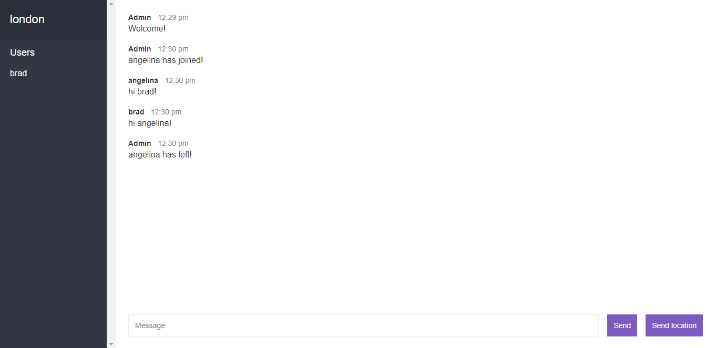

# Chat App

A simple chat room app to work with WebSocket protocol.

[See Demo deployed on Render](https://node-chat-rooms-app.onrender.com/)

## Features

- handling realtime communication between web clients and server with Socket.IO.
- sending messages with emit() and waiting for messages with on().
- managing chat rooms with socket.join and io.to.emit().
- sharing location with Geolocation API and Google Maps.
- avoiding inappropriate messages with bad-words.
- creating templates in Express server with Mustache.
- managing timestamps with Moment.js.

Based on [The Complete Node.js Developer Course](https://www.udemy.com/course/the-complete-nodejs-developer-course-2/) by Andrew Mead (3rd edition, 2019)
